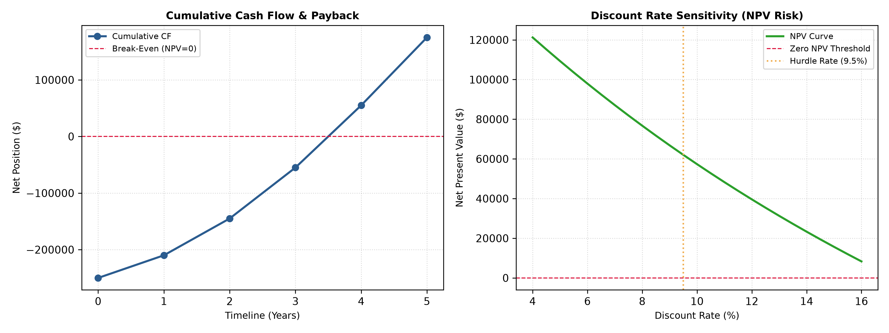
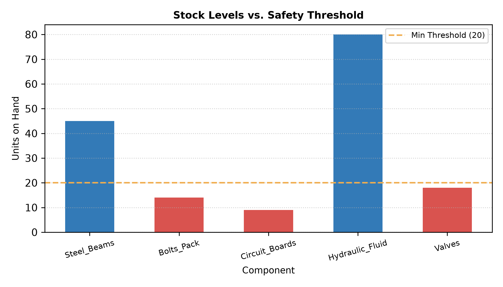

# financial engineering & operations analytics

python tools for running capital asset dcf models, discount rate risk curves, and automated warehouse inventory safety stock audits.

## visual outputs

### capital asset dcf & rate sensitivity dashboard


### warehouse inventory vs. safety threshold auditor


## what's inside
- dcf_engine.py: object-oriented evaluation of multi-year project roi using npv and irr, complete with a break-even timeline and discount rate sensitivity curve.
- inventory_auditor.py: parses stock counts against safety limits, catches items hitting low-stock thresholds, and generates a conditional color-coded status chart.

## governing equations & math behind

### 1. discounted cash flow (dcf) & net present value (npv)
sums the present values of future cash flows against initial capital expenditure:
- NPV = sum(CF_t / (1 + r)^t) - Initial_Capex`
- where CF_t = cash flow at year t, and r = discount rate / hurdle rate.

### 2. internal rate of return (irr)
solves for the precise discount rate where net present value equals zero:
- 0 = sum(CF_t / (1 + IRR)^t) - Initial_Capex

### 3. inventory safety stock threshold
monitors unit positions on hand against minimum limits to automate restocking alerts:
- Shortage_Flag = Units_On_Hand <= Safety_Threshold

## quick setup
```bash
pip install numpy numpy-financial pandas matplotlib
